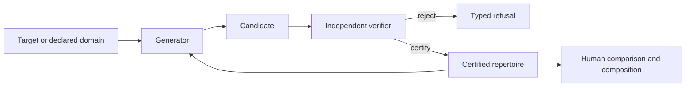

# Partizan

**Search inside correctness.**

Partizan is a proof-carrying research system for computational composition in
finite combinatorial games. It is built around a simple observation: a
mathematical value determines an equivalence class. Economy, surprise, and
form remain properties of each representative.

Most generators search toward correctness and stop when they reach it. Partizan
treats correctness as an admission condition. It certifies a candidate, retains
it, and continues searching among alternative realizations of the same target.

> A mathematical value gives a verdict of equivalence and leaves presentation
> open.

## Status

Partizan is an **alpha research preview** focused on constrained chess and
finite combinatorial-game experiments.

| Item | Status |
| --- | --- |
| Repository | Public research development |
| Package | `partizan-cgt` 0.1.0 release candidate |
| Interface | Python 3.10+ with a Rust/PyO3 core |
| Platforms tested locally | macOS arm64, Rust 1.92, Python 3.14 |
| Cross-platform CI | Active on pull requests for Linux, macOS, and Windows |
| License | **Decision pending** |
| Stable API or release tag | Pending |

This repository is source-visible. Reuse and redistribution await a selected
license. See [`docs/release_blockers.md`](docs/release_blockers.md) for the
release requirements.

## Why Partizan exists

Combinatorial game theory identifies games through their behavior under
addition and comparison. Syntax and appearance disappear under this powerful
abstraction, along with many of the differences on which composition depends.

For a representation \(x\), Partizan distinguishes three levels:

\[
x \longmapsto q(x) \longmapsto \ell(x) \longmapsto v(x),
\]

where:

- \(q(x)\) is the embodied object after declared symmetries;
- \(\ell(x)\) is its complete literal game, including its recursively derived
  options; and
- \(v(x)\) is its exact combinatorial-game value.

For a target game \(g\), the representations

\[
X_g = \{x : v(x)=g\}
\]

form a fixed-value fiber. Partizan asks what a generator can discover by
continuing to search *inside* \(X_g\) after the first member is certified.

Two transitions are especially important:

- **Embodiment-only:** the object changes while the complete literal game and
  exact value remain fixed.
- **Literal-game crossing:** the option structure changes while the exact value
  remains fixed.

These transitions identify the certified differences on which judgments of
economy, surprise, and form can act.

## How the system works



The generator supplies variation. The verifier controls what may be promoted
as mathematically supported. The human remains responsible for choosing what
is worth presenting and why.

Partizan uses classical AI search and exact verification. Its AI contribution
is target-conditioned generative search over a mathematically constrained
design space. Deterministic game semantics provide ground truth. Aesthetic
scoring remains a separate research problem.

## What is in this repository

The repository contains infrastructure developed for constrained chess and
combinatorial-game experiments:

- seeded, byte-deterministic candidate generation;
- versioned proposal, target, verifier-result, and event schemas;
- explicit generator/verifier separation;
- symmetry-aware identity and leakage checks;
- frozen preregistrations, negative controls, and claim gates;
- deterministic baseline and held-out discovery reports;
- content hashes and manifests for retained evidence; and
- a Python package backed by a small Rust/PyO3 extension.

The current supported statement is deliberately narrow:

> Partizan is an experimental suite for structural decomposition and
> combinatorial-game representations in constrained chess positions.

The following capabilities remain future work:

- exact combinatorial-game values for arbitrary chess positions;
- independence of apparent chess subgames throughout all future play;
- a learned-model benefit from decomposition;
- model-guided aesthetic discovery;
- a scientific measure of beauty, agency, or surprise; or
- unrestricted chess thermography.

The full claim register is in
[`docs/research_claims.md`](docs/research_claims.md). The formal domain and trust
boundaries are documented in [`docs/formal_domain.md`](docs/formal_domain.md)
and [`docs/architecture.md`](docs/architecture.md).

## Quick verification with the Python standard library

The following checks exercise the schema, research-plan, candidate-pool, and
discovery contracts using only Python's standard library:

```bash
git clone https://github.com/devinnicholson/partizan.git
cd partizan

python3 agents/label_schema.py self-test
python3 scripts/validate_waves.py
python3 -m unittest \
  tests.test_discovery_contracts \
  tests.test_discovery_candidate_pool -v
```

These commands verify that the public records obey their declared schemas,
identity rules, and frozen research contracts. Native chess and CGT claims use
the full installation below.

## Full development installation

The native extension requires:

- Python 3.10+
- Rust 1.88+
- Maturin 1.8+
- [Bitmesh](https://github.com/devinnicholson/bitmesh)
- [Thermograph](https://github.com/devinnicholson/thermograph)
- [Astralbase](https://github.com/devinnicholson/astralbase)

The three Rust dependencies are frozen release candidates awaiting registry
publication. Development therefore uses external Cargo patches. Local
sibling-directory paths stay in the developer's patch configuration.

Exact commits and installation commands are in
[`docs/development.md`](docs/development.md). Once the package is installed, a
minimal event-stream smoke test is:

```bash
partizan-events from-fen \
  --fen '7k/5KQ1/8/8/8/8/8/8 b - - 0 1' \
  --output /tmp/partizan-event.json

partizan-events validate /tmp/partizan-event.json
python scripts/verify_release.py
```

The emitted event is a versioned, hashed research record for the declared
constrained position and schema.

## Repository map

```text
partizan/
├── python/partizan/       Python package and discovery contracts
├── engine/                Rust/PyO3 bridge and research tooling
├── agents/                Versioned research plans and label schemas
├── data/                  Frozen, manifest-bound evidence slices
├── docs/                  Formal domain, claims, protocols, and reports
├── scripts/               Validation and freeze commands
└── tests/                 Contract, replay, corruption, and leakage tests
```

Useful starting points:

- [`docs/architecture.md`](docs/architecture.md) — components and trust
  boundaries
- [`docs/formal_domain.md`](docs/formal_domain.md) — the exact solver domain
  and boundary
- [`docs/research_claims.md`](docs/research_claims.md) — claim/evidence ledger
- [`docs/reproducibility.md`](docs/reproducibility.md) — frozen v0.1 artifact
  record
- [`docs/experiment_matrix.md`](docs/experiment_matrix.md) — chronological
  experiments, including negative results
- [`CONTRIBUTING.md`](CONTRIBUTING.md) — evidence and artifact requirements

## Reproducibility and evidence policy

Partizan records rejected candidates and negative results alongside retained
discoveries. A scientific claim is promoted only when its declared gate,
evidence, baseline, and falsification condition are all present.

The release workflow uses:

- deterministic serialization;
- SHA-256 content identities;
- immutable source and configuration references;
- separate proposal and verification records;
- explicit leakage registries;
- independent replay where the experiment supports it; and
- corruption tests that must fail for the expected reason.

In Partizan, "proof-carrying" means that every promoted result carries enough
typed provenance to be checked against its declared scope.

## Citation

Release metadata is provided in [`CITATION.cff`](CITATION.cff). Until an
immutable release is published, cite the repository URL together with the exact
commit and artifact manifest used in your work.

## License and contributions

The project license remains under review. Written permission is required to
copy, modify, redistribute, or package this repository. License selection and
third-party dependency review are tracked in
[`docs/release_blockers.md`](docs/release_blockers.md).

Issues and research discussion are welcome. Code contributions should wait
until the license and contribution terms are finalized.
