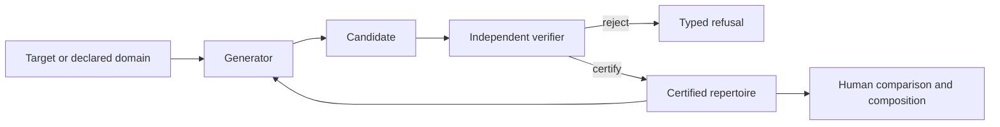

# Partizan

[](https://github.com/devinnicholson/partizan/actions/workflows/ci.yml)

**Search inside correctness.**

Partizan is a proof-carrying research system for computational composition in
finite combinatorial games. It is built around a simple observation: a
mathematical value determines an equivalence class. Economy, surprise, and
form remain properties of each representative.

Partizan begins with exact certification and continues searching among
alternative realizations of the same target. Correctness becomes the admission
condition for a repertoire whose members can still differ in economy, surprise,
and form.

> A mathematical value gives a verdict of equivalence and leaves presentation
> open.

## Status

Partizan is an **alpha research preview** focused on constrained chess and
finite combinatorial-game experiments.

| Item | Status |
| --- | --- |
| Repository | Public research development |
| Package | `partizan-cgt` 0.1.0 release candidate |
| Interface | Python 3.10+ exact short-game API with a Rust/PyO3 chess core |
| Platforms tested locally | macOS arm64, Rust 1.92, Python 3.14 |
| Cross-platform CI | Configured for Linux, macOS, and Windows; hardened candidate run pending |
| License | [GPL-3.0-or-later](LICENSE) |
| Stable API, registry package, or release tag | Pending |

The source code may be used, modified, and redistributed under the terms of
GPL-3.0-or-later. See
[`docs/release_blockers.md`](docs/release_blockers.md) for the remaining
package and release requirements.
The installed-package and source-checkout research surfaces are separated in
[`docs/package_boundary.md`](docs/package_boundary.md).

## Start in five minutes

The bounded short-game API runs directly from a source checkout with Python
3.10 or newer:

```console
git clone https://github.com/devinnicholson/partizan.git
cd partizan
PYTHONDONTWRITEBYTECODE=1 PYTHONPATH=python python3 -m unittest \
  tests.test_bounded_short_game \
  tests.test_semantic_canonical_form -v
PYTHONPATH=python python3 examples/bounded_short_game.py
```

These commands exercise exact four-way comparison, semantic canonicalization,
both comparison-certificate versions, and the public example. Native chess
adapters and the complete development suite require the Rust dependencies
described in [`docs/development.md`](docs/development.md).

## Project family and responsibility

Partizan is the public orchestration layer in a four-repository research
stack. Each repository has a deliberately separate authority:

| Repository | Responsibility | Authority boundary |
| --- | --- | --- |
| **Partizan** | Candidate generation, neural acquisition, exact-admission workflows, evidence records, and repertoire inspection | An exact verifier controls mathematical admission |
| [Thermograph](https://github.com/devinnicholson/thermograph) | Exact bounded comparison and canonicalization of explicit finite normal-play games | A ruleset adapter controls legality and complete move generation |
| [Bitmesh](https://github.com/devinnicholson/bitmesh) | Conservative structural decomposition certificates for supplied chess boards | Separate authorities establish component values, reachability, and future-play claims |
| [Astralbase](https://github.com/devinnicholson/astralbase) | Bounded predecessor exploration and retrograde proof propagation from caller-declared seeds | Separate solvers cover draws, persistent tablebases, and CGT canonicalization |

Partizan composes these layers through typed, content-addressed records. A
downstream result inherits the intersection of their declared scopes; combining
records never enlarges an upstream guarantee.

## Why Partizan exists

Combinatorial game theory identifies games through their behavior under
addition and comparison. Syntax and appearance disappear under this powerful
abstraction, along with many of the differences on which composition depends.

For a representation `x`, Partizan distinguishes three levels:

`x → q(x) → ℓ(x) → v(x)`

where:

- `q(x)` is the embodied object after declared symmetries;
- `ℓ(x)` is its complete literal game, including its recursively derived
  options; and
- `v(x)` is its exact combinatorial-game value.

For a target game `g`, the representations

`X_g = {x : v(x) = g}`

form a fixed-value fiber. Partizan asks what a generator can discover by
continuing to search *inside* `X_g` after the first member is certified.

Two transitions are especially important:

- **Embodiment-only:** the object changes while the complete literal game and
  exact value remain fixed.
- **Literal-game crossing:** the option structure changes while the exact value
  remains fixed.

These transitions identify the certified differences on which judgments of
economy, surprise, and form can act.

## How the system works


```mermaid
flowchart LR
    T["Target or declared domain"] --> G["Generator"]
    G --> C["Candidate"]
    C --> V["Independent verifier"]
    V -- "reject" --> R["Typed refusal"]
    V -- "certify" --> F["Certified repertoire"]
    F --> G
    F --> H["Human comparison and composition"]
```

The generator supplies variation. The verifier controls what may be promoted
as mathematically supported. The human remains responsible for choosing what
is worth presenting and why.

Partizan uses classical AI search and exact verification. Its AI contribution
is target-conditioned generative search over a mathematically constrained
design space. Deterministic game semantics provide ground truth. Aesthetic
scoring remains a separate research problem.

## Fixed-value explorer

The first end-to-end explorer is available for explicit finite normal-play
short games:

```bash
partizan explore \
  --target tests/fixtures/fixed_value/target-zero.valid.json \
  --seed 23 \
  --count 8 \
  --budget 8 \
  --max-results 8 \
  --output /tmp/zero-repertoire.json

partizan verify /tmp/zero-repertoire.json
partizan inspect /tmp/zero-repertoire.json
```

It applies Conway's recursive order relation, admits candidates equal to the
target, fingerprints their embodiments and complete literal games separately,
and classifies the transitions within the resulting repertoire. The output is
self-contained and supports deterministic replay of every admission decision.

The exact data contract and comparison scope are documented in
[`docs/fixed_value_explorer.md`](docs/fixed_value_explorer.md).

## Bounded exact short games

The source-only Python API compares, canonicalizes, and certifies explicit
finite normal-play short games. It requires Python 3.10+ and no compiled
extension.

```python
from partizan import (
    ComparisonOutcome,
    build_short_game_comparison_certificate_v2,
    compare_short_game_bounded,
    semantic_canonical_form_bounded,
    verify_short_game_comparison_certificate_v2,
)

zero = {"left": [], "right": []}
one = {"left": [zero], "right": []}
star = {"left": [zero], "right": [zero]}
half = {"left": [zero], "right": [one]}
elkies_half = {"left": [zero, star], "right": [one]}

assert compare_short_game_bounded(zero, star).outcome is ComparisonOutcome.FUZZY

reduced = semantic_canonical_form_bounded(elkies_half)
assert reduced.canonical_game == half
assert reduced.soundness_equal and reduced.irreducible and reduced.idempotent

certificate = build_short_game_comparison_certificate_v2(
    elkies_half,
    half,
    candidate_binding={"artifact": "elkies-half"},
    target_binding={"artifact": "half"},
)
assert verify_short_game_comparison_certificate_v2(certificate) == (
    True,
    "valid",
)
```

The comparison result is exactly one of `less`, `equal`, `greater`, or
`fuzzy`. Literal identities preserve explicit option structure. Semantic
canonical identities use deterministic domination and reversibility reduction.
Every completed reduction performs equality, irreducibility, and idempotence
audits.

Comparison certificate v1 remains frozen with its historical null semantic
fields. Certificate v2 adds independently recomputed semantic canonical IDs
and binds the canonical rewrite limit. The named operational profiles are
`partizan.bounded_short_game.order7.v1` and
`partizan.bounded_short_game.digraph8.v1`.

The full API, identity rules, limits, certificate semantics, and validation
evidence are documented in
[`docs/bounded_short_game.md`](docs/bounded_short_game.md). A complete runnable
example is available at
[`examples/bounded_short_game.py`](examples/bounded_short_game.py).

## Experimental neural proposal ranking

The order-7 Digraph Placement workflow includes a deterministic directed
message-passing ranker for fresh, same-operator candidate pools. Exact
verification remains the admission authority. The architecture, frozen grid,
outcome-free ranking API, and validation protocol are documented in
[`docs/digraph_neural_ranker.md`](docs/digraph_neural_ranker.md).

An additional target-free encoder learns graph distance from training-only
literal-game equivalence groups. Its acquisition API combines the frozen
equality score with distance from an arm-local repertoire while keeping exact
decisions and semantic identifiers outside inference. See
[`docs/digraph_diversity_ranker.md`](docs/digraph_diversity_ranker.md).

## Bounded chess adapter

Constrained FENs can now enter the same exact explorer through a replayable
native adapter:

```bash
partizan chess-adapt \
  --fen '7k/5K2/6Q1/8/8/8/8/8 w - - 0 1' \
  --max-plies 1 \
  --node-budget 100 \
  --output /tmp/mate-frontier.adapter.json

partizan chess-verify /tmp/mate-frontier.adapter.json
partizan chess-target /tmp/mate-frontier.adapter.json \
  --name mate-frontier-one \
  --output /tmp/mate-frontier.target.json
partizan chess-candidate /tmp/mate-frontier.adapter.json \
  --ordinal 0 \
  --output /tmp/mate-frontier.candidates.jsonl
```

`partizan chess-search` accepts a target adapter record plus a JSONL stream of
candidate adapter records and emits a replayable fixed-value repertoire in one
step.

The adapter records Astralbase's domain decision, Bitmesh's structural
certificate and one-ply status, the literal projection of a complete bounded
Shakmaty move expansion, and Thermograph's structural identity. Partizan then
certifies value equality with its independent recursive-order verifier. Every
horizon and resource limit is part of the content-addressed record;
unsupported FENs and exhausted budgets produce typed refusals. Embodiment
fingerprints use a clock-free chess move-state key, preventing halfmove and
fullmove counters from creating false variation.

The rule, trust boundary, checked crossing, and schema are documented in
[`docs/bounded_chess_adapter.md`](docs/bounded_chess_adapter.md). New records
use the v0.2 contract; the original v0.1 schema and a golden record remain
available for historical replay.

## Live visualizer

The site in [`visualizer/`](visualizer/) shows three order-7 Digraph Placement
positions with exact value 0. A reader can compare their graphs, inspect their
complete-game identities, and export an exact pair-comparison record. The
overlay marks shared arcs and the arcs found only in either form, making the
structural change visible without weakening the certificate boundary.

The displayed evidence is generated from native records:

```bash
PYTHONPATH=python python3 scripts/build_elkies_study_evidence.py --check
PYTHONPATH=python python3 scripts/build_visualizer_evidence.py --check
```

Run the visualizer locally with Node.js 22 or newer:

```bash
cd visualizer
npm ci
npm run dev
```

Its evidence contract, interaction states, and verification boundary are
documented in [`docs/visualizer.md`](docs/visualizer.md).

## What is in this repository

The repository contains infrastructure developed for constrained chess and
combinatorial-game experiments:

- seeded, byte-deterministic candidate generation;
- versioned proposal, target, verifier-result, and event schemas;
- explicit generator/verifier separation;
- symmetry-aware identity and leakage checks;
- frozen preregistrations, negative controls, and claim gates;
- deterministic baseline and held-out discovery reports;
- content hashes and manifests for retained evidence; and
- a Python package backed by a small Rust/PyO3 extension.

The current supported statement is deliberately bounded:

> Partizan is an experimental orchestrator for bounded exact short games,
> proof-carrying fixed-value repertoire search, and constrained-chess adapters.

The following capabilities remain future work:

- unbounded combinatorial-game values for arbitrary chess positions;
- independence of apparent chess subgames throughout all future play;
- a learned-model benefit from decomposition;
- model-guided aesthetic discovery;
- a scientific measure of beauty, agency, or surprise; or
- unrestricted chess thermography.

The full claim register is in
[`docs/research_claims.md`](docs/research_claims.md). The formal domain and trust
boundaries are documented in [`docs/formal_domain.md`](docs/formal_domain.md)
and [`docs/architecture.md`](docs/architecture.md).

## Quick verification with the Python standard library

The following checks exercise a fast subset of the schema, research-plan,
candidate-pool, and discovery contracts using only Python's standard
library, without building the native extension:

```bash
git clone https://github.com/devinnicholson/partizan.git
cd partizan

python3 agents/label_schema.py self-test
python3 scripts/validate_waves.py
python3 -m unittest \
  tests.test_bounded_short_game \
  tests.test_semantic_canonical_form \
  tests.test_discovery_contracts \
  tests.test_discovery_candidate_pool -v
PYTHONPATH=python python3 examples/bounded_short_game.py
```

These commands verify that the public records obey their declared schemas,
identity rules, and frozen research contracts. They are a subset of CI's gate,
which runs the full suite (`python -m unittest discover -s tests`)
against the installed package. Native chess and CGT claims use the full
installation below.

## Full development installation

The native extension requires:

- Python 3.10+
- Rust 1.88+
- Maturin 1.9.3+
- [Bitmesh](https://github.com/devinnicholson/bitmesh)
- [Thermograph](https://github.com/devinnicholson/thermograph)
- [Astralbase](https://github.com/devinnicholson/astralbase)

The three Rust dependencies are frozen release candidates awaiting registry
publication. Development therefore uses external Cargo patches. Local
sibling-directory paths stay in the developer's patch configuration.

Exact commits and installation commands are in
[`docs/development.md`](docs/development.md). Once the package is installed, a
minimal event-stream smoke test is:

```bash
partizan-events from-fen \
  --fen '7k/5KQ1/8/8/8/8/8/8 b - - 0 1' \
  --output /tmp/partizan-event.json

partizan-events validate /tmp/partizan-event.json
python scripts/verify_release.py
```

The emitted event is a versioned, hashed research record for the declared
constrained position and schema.

## Repository map

```text
partizan/
├── python/partizan/       Python package and discovery contracts
├── engine/                Rust/PyO3 bridge and research tooling
├── examples/              Source-only executable examples
├── agents/                Versioned research plans and label schemas
├── data/                  Frozen, manifest-bound evidence slices
├── docs/                  Formal domain, claims, protocols, and reports
├── scripts/               Validation and freeze commands
└── tests/                 Contract, replay, corruption, and leakage tests
```

Useful starting points:

- [`docs/ecosystem_compatibility.md`](docs/ecosystem_compatibility.md) —
  repository responsibilities, versions, toolchains, and release order
- [`docs/architecture.md`](docs/architecture.md) — components and trust
  boundaries
- [`docs/bounded_short_game.md`](docs/bounded_short_game.md) — bounded exact
  comparison, semantic canonicalization, and certificates
- [`docs/formal_domain.md`](docs/formal_domain.md) — the exact solver domain
  and boundary
- [`docs/research_claims.md`](docs/research_claims.md) — claim/evidence ledger
- [`docs/reproducibility.md`](docs/reproducibility.md) — frozen v0.1 artifact
  record
- [`docs/experiment_matrix.md`](docs/experiment_matrix.md) — chronological
  experiments, including negative results
- [`docs/artifact_policy.md`](docs/artifact_policy.md) — rules for retained
  fixtures, manifests, and large generated outputs
- [`docs/release_checklist.md`](docs/release_checklist.md) — gates for an
  immutable public release
- [`docs/repository_settings.md`](docs/repository_settings.md) — coordinated
  GitHub metadata, branch, ruleset, and security settings
- [`CONTRIBUTING.md`](CONTRIBUTING.md) — evidence and artifact requirements

## Reproducibility and evidence policy

Partizan records rejected candidates and negative results alongside retained
discoveries. A scientific claim is promoted only when its declared gate,
evidence, baseline, and falsification condition are all present.

The release workflow uses:

- deterministic serialization;
- SHA-256 content identities;
- immutable source and configuration references;
- separate proposal and verification records;
- explicit leakage registries;
- independent replay where the experiment supports it; and
- corruption tests that must fail for the expected reason.

In Partizan, "proof-carrying" means that every promoted result carries enough
typed provenance to be checked against its declared scope.

## Citation

Release metadata is provided in [`CITATION.cff`](CITATION.cff). Until an
immutable release is published, cite the repository URL together with the exact
commit and artifact manifest used in your work.

## License and contributions

Partizan is licensed under the [GNU General Public License v3.0 or later](LICENSE)
(GPL-3.0-or-later). This choice follows directly from the native engine's
dependency on [Shakmaty](https://github.com/niklasf/shakmaty) (GPL-3.0): the
compiled `partizan._native` extension is a combined work, so the whole project
is distributed under compatible copyleft terms. Remaining release gates
(upstream registry publication, immutable tags, public release publication)
are tracked in [`docs/release_blockers.md`](docs/release_blockers.md).

Issues and research discussion are welcome. Contributions use the
[`DCO.md`](DCO.md) sign-off described in [`CONTRIBUTING.md`](CONTRIBUTING.md).
Security reports follow [`SECURITY.md`](SECURITY.md), and general support
questions follow [`SUPPORT.md`](SUPPORT.md).
